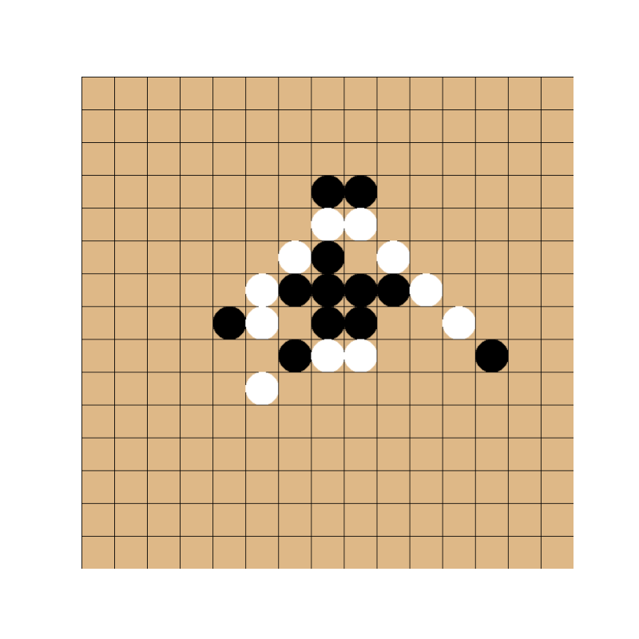

# Gomoku

Gomoku is a strategy board game typically played with Go pieces on a Go board. Two players take turns placing stones on a grid, aiming to align five stones in a row (horizontally, vertically, or diagonally). The board size is typically 15 x 15, but any size (above 5 obviously) is playable. 
This Python implementation includes an interactive board that allows players to click to place their stones.



## Installation
After cloning the repository: 
```bash
cd gomoku
pip install -r requirements.txt
```

## Usage
1. Run the script:
   ```bash
   python play_gomoku.py
   ```
2. Take turns clicking on the desired fields to place stones. 
3. `ctrl-c` in the terminal to end the game.


You can customize the board size in `play_gomoku.py`:
```python
board_size = 10 
```

## Gameplay Instructions
- Player X always starts first.
- Players alternate turns by clicking on the desired cell to place their stone.
- The game ends when a player aligns five stones in a row or all cells are filled.

## Customization
You can adjust the following settings in the `play_gomoku.py`:
- **Board Size**: Change the `board_size` variable to customize the size of the grid.

## Visualization Options
The game supports two types of visualizations that can be set in `play_gomoku.py`:

1. Graphical Visualization: Uses an interactive graphical interface to display the board and allow players to click to place stones. This is the default visualization.

```python
from gomoku.visualizer import GomokuVisualizer
visualizer = GomokuVisualizer(size=board_size)
```

2. Terminal Visualization: Displays the board in the terminal and prompts players to enter the row and column numbers to place stones.
```
from gomoku.visualizer import TerminalVisualizer
visualizer = TerminalVisualizer()
````

## License
This project is licensed under the MIT License. See the LICENSE file for details.

